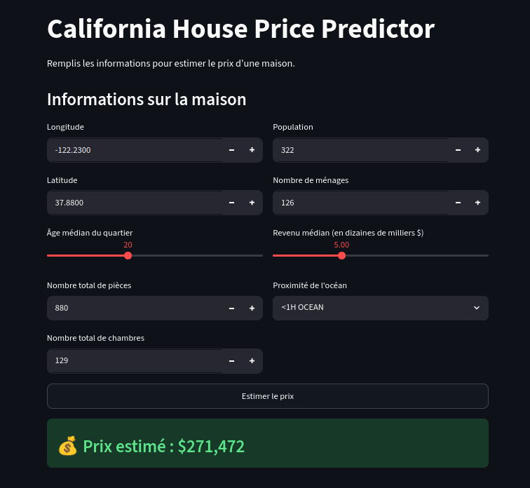

# 🏠 California House Price Predictor

Application de prédiction des prix immobiliers en Californie,
basée sur le dataset California Housing.



## 📊 Dataset
- **Source** : California Housing Dataset (1990 Census)
- **Features** : longitude, latitude, housing_median_age, total_rooms,
  total_bedrooms, population, households, median_income, ocean_proximity
- **Target** : median_house_value

## 🤖 Modèle
- **Algorithme** : Random Forest Regressor
- **Preprocessing** : StandardScaler (numériques) + OneHotEncoder (catégorielles)
- **Pipeline** : sklearn Pipeline + ColumnTransformer

## 🚀 Installation

```bash
git clone https://github.com/abdoulayeDABO/house_price_prediction.git
cd house-price-pred
uv sync
```

## ⚙️ Utilisation

### 1. Entraîner le modèle
```bash
uv run python train.py
```

### 2. Lancer l'application
```bash
uv run streamlit run app.py
```